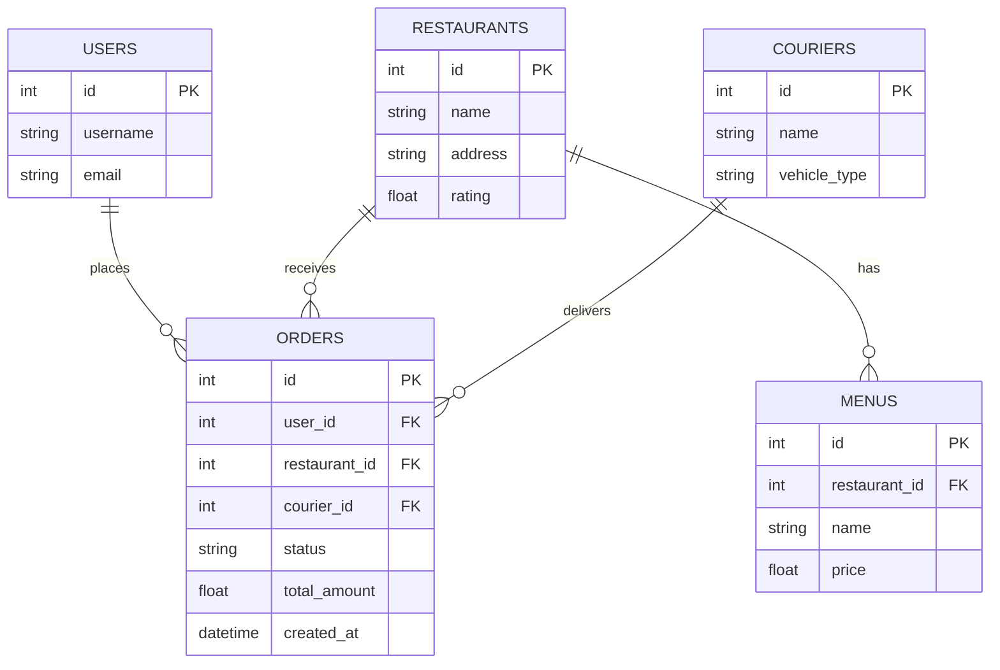
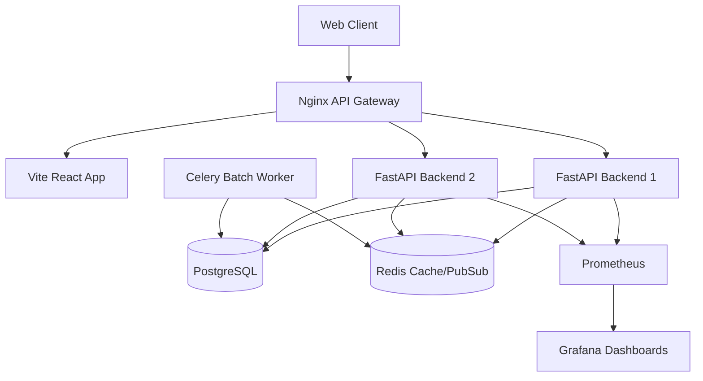
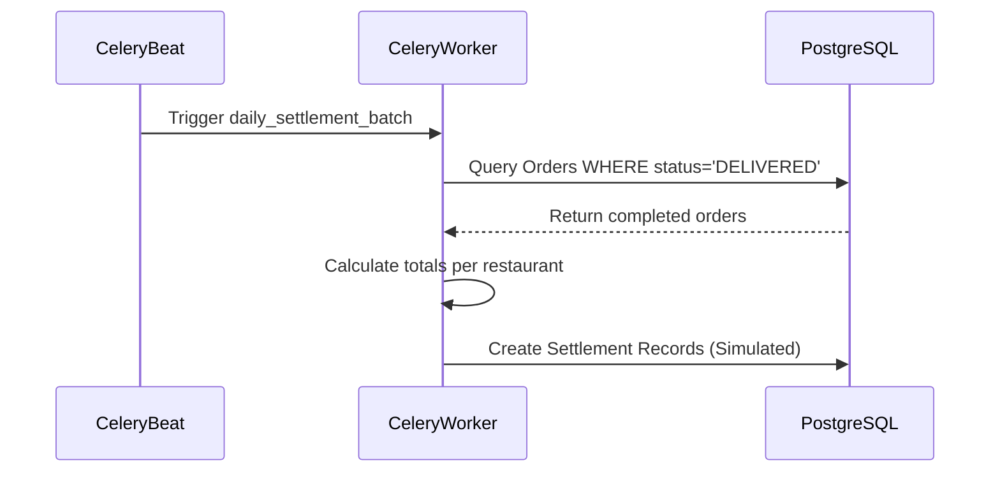

# Food Delivery System - Project Report

## R1. Business Scenario and Requirements
**Scenario:** A multi-vendor food delivery marketplace. Users browse restaurants, place orders, couriers are dispatched to pick up and deliver the food, and daily settlements are calculated for the restaurants.

**Use Cases:**
1. **User browses restaurants:** User opens the app, sees a list of restaurants and their menus. (Primary Actor: User)
2. **User places an order:** User selects items, confirms order, and pays. (Primary Actor: User)
3. **Restaurant accepts order:** Restaurant receives order notification and marks it as preparing. (Primary Actor: Restaurant Owner)
4. **Courier accepts delivery:** Courier receives broadcasted order, accepts it, and picks it up. (Primary Actor: Courier)
5. **System settles payments:** End of day, the batch job calculates the amount owed to each restaurant. (Primary Actor: System)

**Non-functional Requirements:**
- **Scale:** 10,000 active users, 1,000 active couriers.
- **Latency:** API responses under 200ms.
- **Availability:** 99.9% uptime.
- **Security:** Endpoints must be protected against DDoS (Rate Limiting).

## R2. Data Model and Architecture Diagrams

### ER Diagram

### System Architecture Diagram

## R5. Polyglot Persistence
**Choice:** Redis
**Rationale:** While PostgreSQL stores the transactional truth of orders, we needed an in-memory data store for two reasons:
1. **Caching:** The restaurant list is read-heavy. Storing it in Redis significantly reduces load on PostgreSQL.
2. **Pub/Sub Messaging:** When an order is created, couriers need to be notified in real-time. We use Redis Pub/Sub channels to broadcast new orders across all instances of our backend, ensuring fast delivery of events to websocket connections.

## R6. Cache, Indexing, and Storage Optimisation
**Optimisations Implemented:**
1. **Redis Caching:** We cache the `GET /api/restaurants` endpoint in Redis for 60 seconds.
2. **Database Indexing:** We added B-Tree indexes to `Order.status` and `Restaurant.rating` to speed up query filtering during the batch settlement process and searching for top-rated restaurants.
*Impact:* The cached restaurants endpoint reduces response times from ~50ms (Postgres query + serialization) to <5ms (Redis string retrieval).

## R10. Batch Processing Pipeline
We implemented a daily settlement batch pipeline using Celery.

## R11. From-Scratch System Component
**Component:** Token-Bucket Rate Limiter.
**Design Decisions:** We built a distributed Token-Bucket rate limiter backed by Redis Lua scripting. This ensures atomicity across multiple FastAPI backend replicas. It limits incoming HTTP requests by IP address. The Lua script evaluates capacity, calculates elapsed time, adds new tokens, and deducts a token if permitted, all in a single atomic operation to avoid race conditions.

## R12. Observability: Traces, Logs, and Metrics
We instrumented the FastAPI application with Prometheus client libraries.
Metrics collected:
- `http_requests_total`
- `http_request_duration_seconds`

*(Please insert screenshots of the Grafana dashboard visualizing these metrics here)*

